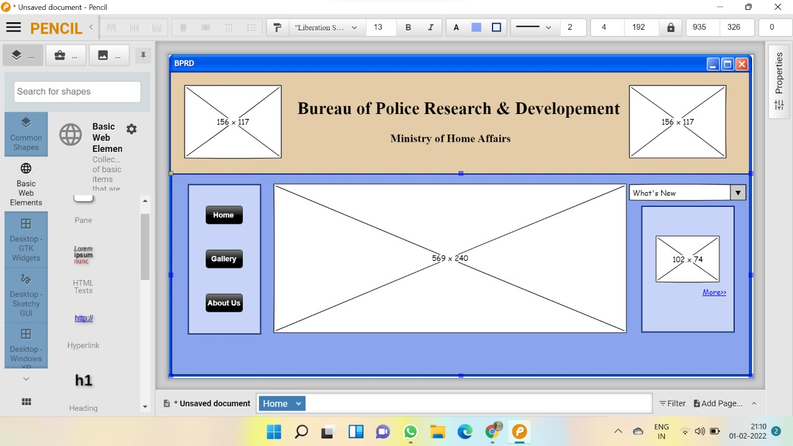
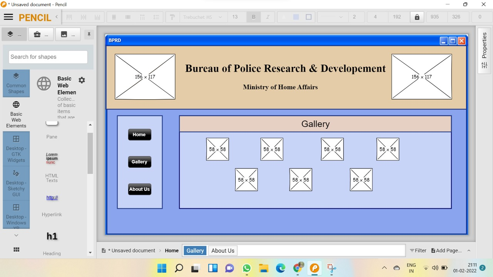

# Wire frame for a website

## AIM:
To design a wire frame for a website.

## DESIGN STEPS:

### Step 1:
Resize the canvas as per the requirement.

### Step 2:
Add a box assuming the head part of the page and logo images in it.

### step 3:
Add a box with buttons as a navigation buttons.

### step 4:
Add a table and a Calendar.

### step 5:
Add a Text for home page and About us page and for photo gallery page add image boxes.

## OUTPUT:

## Result:
Thus a wire frame is designed for a given website.
